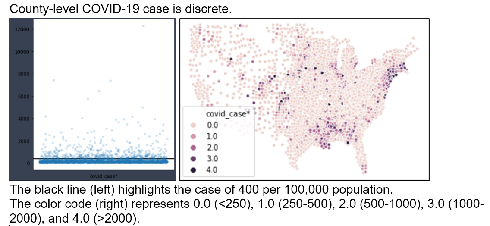

# COVID-19-Attributes-and-Prediction
COVID-19 Cases in US - 19th May, 2020

# Introduction
The COVID-19 epidemic has rapidly become a national crisis in the US ever since the first case was confirmed in February 2020. Cases and deaths arising from COVID-19, however, differed demographically, psychographically, and geographically. Important factors attributed to such heterogeneity are hard to measure, yet pivotal to the manipulation of the epidemic outbreak. Currently, there have been numerous studies using machine-learning approaches to tackle COVID-19 associated challenges. Among which, most aimed to forecast when or where a daily case or death would reach the peak, some using patient blood to predict end-of-life expectancy. In this article, instead of forecasting, the goal is to elucidate what contributes to such a heterogeneity of COVID-19 cases across the US. The results will provide important keys to manage the ongoing epidemic. Furthermore, some independent variables included in the models are specific, for example, air pollution and smoking may make people susceptible to respiratory disease, and the low rate of commuters driving alone to work may indicate a higher chance of being exposed to the virus when taking a public transportation. This article will treat the COVID-19 issue as a classification problem, since the aim is to pick up counties that are heavily affected and their associated features. As such, the classification performance metrics, i.e., predictive accuracy, precision, recall, F1, and areas under the curve (AUC) value under the ROC curves will be the main assessments.

# Table of Folders (Scripts should be used following this order)
- Database
- DataCleaning
- OutcomeClassification
- Oversampling (split training and test datasets)
- FeatureEngineering
- FeatureSelection
- k-means DEA
- Functions
- Recursive feature elimination (RFE feature selection)
- Random forests (RF)
- Least absolute shrinkage and selection operator (LASSO)
- Support-vector machines (SVM) 
- Quadratic discriminant analysis (QDA)

# Conclusion
All the models were able to predict the COVID-19 status at above 70% accuracy, with the highest being the RF model at 91%. Using less features, however, lowered the accuracy in general, as reflected by the pronounced error rates in the training set. The RF and SVM models reached the highest accuracy when using all 15 variables.

The two highest recall values appeared in SVM and LASSO when using a relatively small subset of features. It should be noted that the precision of both dropped to only 17 – 18%, indicating that these two models had a significantly higher false-positive rate. In other words, the models falsely detected more counties as “highly infected”. In terms of selecting the most appropriate models, a high precision rate and median recall should be achieved. The RF model is the best choice; it had a precision of 0.62 although the recall was only 0.23. In comparison, LASSO and SVM all had a better recall than RF, but the precision rates were at least two times worse than that of RF. 

The resulting predictive metrics from different machine-learning models revealed that it is relatively feasible to obtain a high accuracy and a fair AUC value. However, how well the models can detect the true positive signal, i.e., high recall and high precision, is the biggest challenge. Adjusting the number of variables, in this case, only raises the bias and does not improve the model performance.

It is highly possible that the 15 variables examined do not include enough key factors which cause a high infection rate in some counties. In the future, when the data are available, features such as the number of “holiday events during the COVID-19 outbreak” and “manufacturers per county”, which are both associated with people gathering or working closely, should be considered.     
